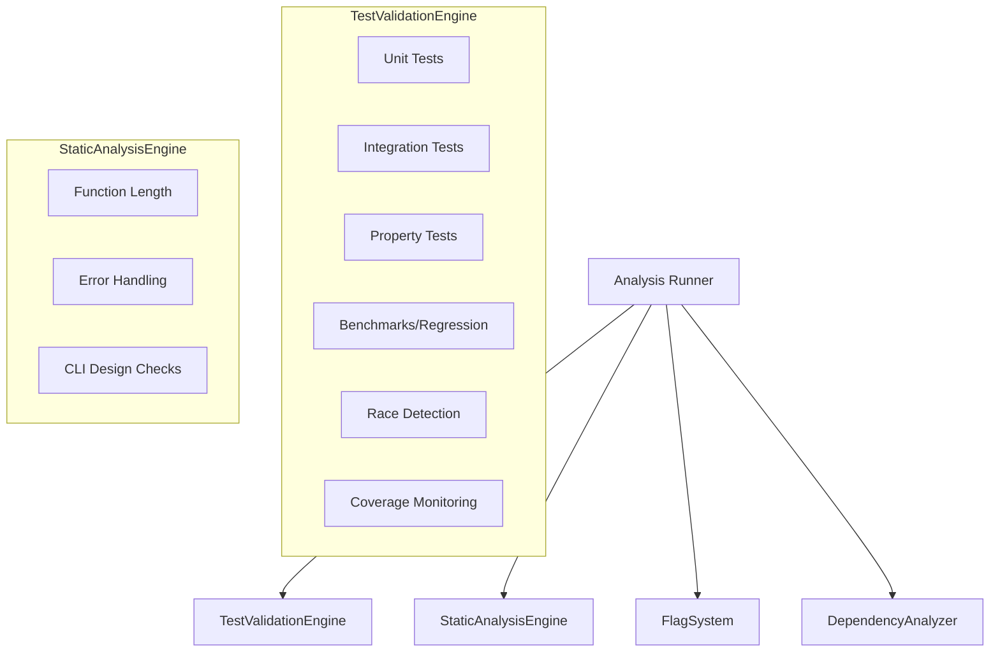

# Checkpoint System Remediation Plan & Technical Specification

## 1. Introduction
This document outlines the plan to upgrade the Checkpoint system, addressing security vulnerabilities, logical failures, redundancies, and coverage gaps identified in recent audits.

## 2. Security Remediation

### 2.1. Path Injection in `Organizer`
*   **Issue:** `CreateSnapshot(name string)` directly joins the `name` parameter to create a directory path, susceptible to path traversal (e.g., `name="../../etc"`).
*   **Remediation:**
    *   Sanitize `name` using `filepath.Base(name)`.
    *   Validate that the final `snapshotDir` is a sub-directory of `active/snapshots`.
    *   Example:
        ```go
        cleanName := filepath.Base(name)
        snapshotDir := filepath.Join(activeDir, "snapshots", cleanName)
        // Additional check to ensure we didn't escape
        if !strings.HasPrefix(snapshotDir, filepath.Join(activeDir, "snapshots")) {
            return fmt.Errorf("invalid snapshot name")
        }
        ```

### 2.2. Robust `govulncheck` Integration
*   **Issue:** Swallowed errors when the tool is missing; brittle string matching on output.
*   **Remediation:**
    *   Use `govulncheck -json ./...` for machine-readable output.
    *   Define a Go struct to parse the JSON output.
    *   If `govulncheck` execution fails (e.g., command not found), return a specific `Issue` with `Severity: Warning` notifying the user that security scanning was skipped.
    *   Update `DependencyAnalyzer.checkVulnerabilities` to handle these scenarios.

## 3. Logical Corrections

### 3.1. Snapshot Management (Copy vs. Move)
*   **Issue:** `os.Rename` moves files from `latest/` to a new snapshot, leaving `latest/` empty.
*   **Remediation:**
    *   Implement a recursive copy utility in `internal/checkpoint/util.go` (or similar).
    *   Update `Organizer.CreateSnapshot` to use this copy utility.
    *   After a successful copy, the `latest/` directory remains populated with the most recent results.

### 3.2. Workspace Cleanup Registration
*   **Issue:** `Collector` creates temporary workspaces but doesn't register them with `CleanupManager`, leading to orphaned directories on crashes.
*   **Remediation:**
    *   Modify `Runner` to hold a reference to `CleanupManager`.
    *   Update `Runner.Run(ctx context.Context, path string)` to call `r.cleanupManager.RegisterWorkspace(ws)` immediately after workspace creation.

## 4. Architectural Simplification

### 4.1. Engine Consolidation
*   **Issue:** Overlap between `CIEngine`, `TestingBattery`, and `QualityEngine` regarding test execution and coverage.
*   **Remediation:**
    *   **Consolidate Execution:** Create a `TestValidationEngine` responsible for all `go test` invocations (`-cover`, `-short`, `-race`, `-bench`).
    *   **Unified Coverage Parsing:** Move `CoverageMonitor` logic to a shared package used by the consolidated engine.
    *   **Role Definition:**
        *   `CIEngine`: Coordinates high-level quality gates and aggregate status.
        *   `TestValidationEngine`: Handles all execution-based testing.
        *   `StaticAnalysisEngine`: (Merged from parts of `QualityEngine` and `TestingBattery`) Handles all AST-based checks.

### 4.2. Interface Flattening in `engine.go`
*   **Issue:** Deep, specific interface hierarchy causing boilerplate.
*   **Remediation:**
    *   Standardize on the base `AnalysisEngine` interface.
    *   Use a **Task Registry** pattern:
        ```go
        type AnalysisTask func(ctx context.Context, path string, ws *Workspace) ([]Issue, error)
        
        type BaseEngine struct {
            tasks []AnalysisTask
        }
        
        func (e *BaseEngine) Analyze(...) ([]Issue, error) {
            // Iterates and executes registered tasks
        }
        ```

## 5. False Positive/Negative Reduction

### 5.1. AST-based Flag Detection
*   **Issue:** `strings.Contains` causes false positives for flags with shared prefixes (e.g., `--json` matching `--jsonl`).
*   **Remediation:**
    *   Update `FlagSystem` to use `go/ast` to find usages of the configuration struct fields.
    *   Map flags to struct fields accurately (leveraging existing `mapFlagToFieldName` but with exact matching).
    *   When scanning for usage, look for `SelectorExpr` where the X is the config variable and Sel is the field name.

## 6. Coverage Gaps & New Features

### 6.1. Performance Regression Testing
*   **Specification:**
    *   Add `AnalyzePerformance` task to the new `TestValidationEngine`.
    *   Run `go test -bench=. -benchmem ./...`.
    *   Store results in `.checkpoint/benchmarks/baseline.json`.
    *   Compare current run results against baseline; flag regressions > 10% as `Severity: High` issues.

### 6.2. Race Detection
*   **Specification:**
    *   Integrate `go test -race ./...` into the CI/Test validation flow.
    *   Report any race conditions detected as `Severity: Critical` issues.

### 6.3. Enhanced Error Handling Analysis
*   **Specification:**
    *   Expand `QualityEngine` (or the new `StaticAnalysisEngine`) to check for:
        *   Unchecked error returns.
        *   Shadowed `err` variables.
        *   Use of `fmt.Errorf` without `%w` for wrapping (where appropriate).

## 7. General Refactoring

### 7.1. Configuration-Driven Paths
*   **Issue:** Hardcoded paths like `internal/` or `cmd/chexum/main.go` throughout the engines.
*   **Remediation:**
    *   Update `internal/config/types.go` to include a `DiscoveryConfig` struct:
        ```go
        type DiscoveryConfig struct {
            InternalPath string `toml:"internal_path"`
            MainEntry    string `toml:"main_entry"`
            DocsPath     string `toml:"docs_path"`
        }
        ```
    *   Inject these paths into engine constructors.
    *   Ensure all engines use these configured paths for analysis.

## 8. Proposed Architecture Diagram



## 9. Implementation Roadmap
1.  **Phase 1: Security & Logic Fixes** (Immediate priority)
2.  **Phase 2: Architectural Refactor** (Interface simplification and engine consolidation)
3.  **Phase 3: Accuracy Improvements** (AST parsing for flags and govulncheck)
4.  **Phase 4: Feature Gaps** (Performance benchmarks and race detection)
