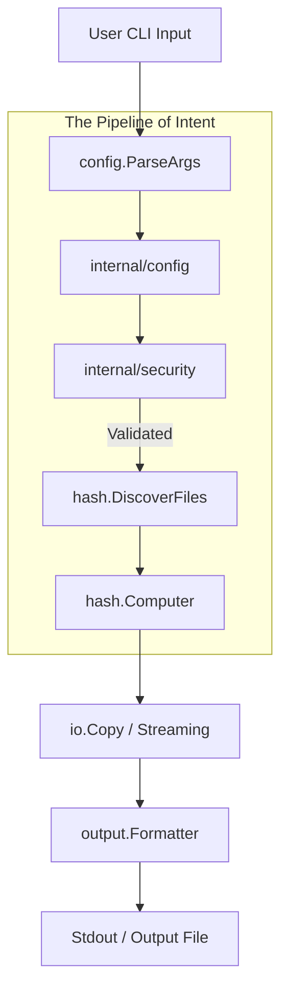

# Chexum Project Master Guide

## Overview

Project `chexum` is a high-performance, security-focused file hashing utility. It consists of two primary components:
1.  **chexum**: The core CLI tool for computing and comparing file hashes.
2.  **checkpoint**: A built-in quality assurance and auditing engine used by developers to ensure the project meets its own high standards.

## System Architecture

The following diagram illustrates the data flow from a user command to the final hash output:

## interaction between chexum and checkpoint

`chexum` is the product, and `checkpoint` is the guardian.

- **Checkpoint** runs automated audits against the `chexum` codebase.
- It identifies security risks, low test coverage, and documentation drift.
- It generates a **Remediation Plan** that guides developers in improving the tool.

## Core Mandates

1.  **Streaming over Buffering**: Chexum never loads entire files into memory.
2.  **Global Split Streams**: Data goes to `stdout`, context (logs/errors) goes to `stderr`.
3.  **Human-First, Machine-Ready**: Output is readable by humans and easily parsed by scripts.
4.  **Zero-Gap Security**: Strict input validation and protected configuration to prevent self-modification.
